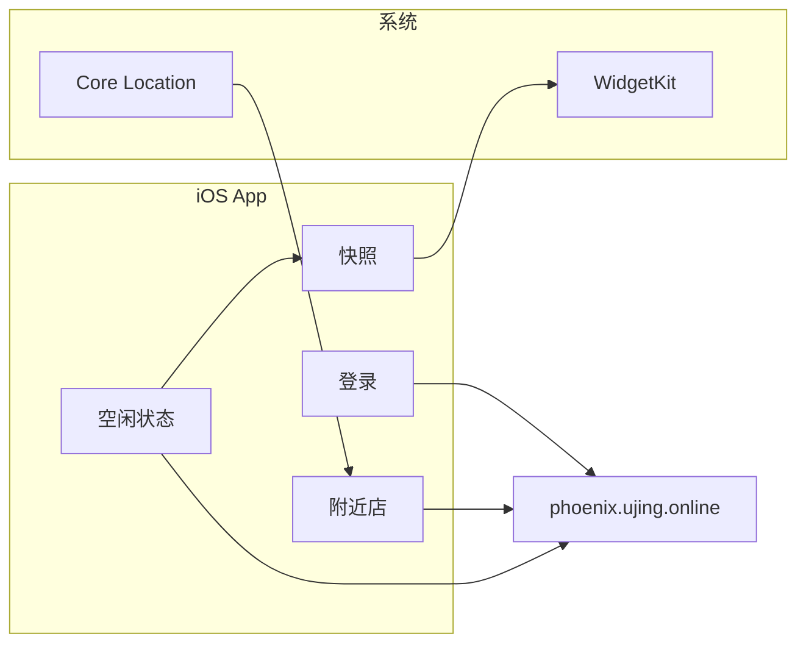

# LiteU

登录 U 净后，按定位选择附近洗衣房，查看洗衣机空闲与等待时间，主屏幕小组件展示最近一次快照。

不含预约、扫码、单台机号、烘干机/干衣机。直连 `https://phoenix.ujing.online`，无自建后端。

## 架构



| 数据 | 存放 |
|---|---|
| JWT | Keychain |
| 选中的 `storeId` | App Group UserDefaults |
| 状态快照（空闲、总数、最短等待、更新时间） | App Group，供小组件读取 |

网络：`URLSession`。

## 用户流程

1. 无 JWT → 手机号 → 发短信 → 验证码 → 存 token。
2. 已登录、未选店 → 定位（可手动改点）→ `stores/near` → 多选保存。
3. 首页按选中 `storeId` 拉状态，下拉刷新。
4. 每次成功查询写快照；小组件展示快照。系统刷新约 15 分钟。
5. 查询 401 → 清 token → 回登录。

## API

基址：`https://phoenix.ujing.online`。业务成功：`code == 0`。

登录与查询使用不同客户端头。发短信签名密钥：`Secrets/captcha-hmac-key.txt`。

### 发短信

`GET /api/v1/wechat/captcha/create`

| | |
|---|---|
| Query | `mobile`，`type=1`，`nonce`（UUID hex），`timestamp`（unix 秒） |
| 签名 | `signature = Base64(HMAC-SHA256(key, nonce \|\| timestamp))`，`key` 为密钥文件的 UTF-8 字节 |
| Header | `x-app-code: BO`，`x-app-version: 1.1.0` |

手机号：`1` + 10 位数字。

### 登录

`POST /api/v1/login`

JSON：`{"mobile","captcha"}`。Header 同发短信。Token：`data.token`。

### 附近洗衣房

`GET /api/v1/stores/near`

Query：`lat`，`lont`，`scope`（默认 2000），`page=1`，`size=50`，`mode=BA`。

Header：`Authorization: Bearer <jwt>`，`x-app-code: ZA`，`x-app-version: 2.4.18`。

列表：`data.storeList[]`。洗衣机计数来自 `storeInfo` 中 `category == 1`：`num` 为总数，`access` 为空闲。

### 等待时间

`GET /api/v1/devices/reserve?storeId=`

Header 同附近店。仅当该店 `total > idle` 时调用。

`data.devices[].device`：`deviceTypeName`，`free`，`total`，`waitTime`（分钟）。名称含「烘干」或「干衣」的丢弃。同店结果缓存 60 秒。

## 领域模型

```text
StoreStatus
  id, name
  idle, total
  machines: [MachineType]
  waitMinutes

MachineType
  name, idle, total, waitMinutes
```

`idle` / `total` 为 `category == 1` 汇总。`machines` 仅未满员时有。`waitMinutes` 为 `machines` 里 `waitTime` 的最小正值。

小组件快照：选中店的 `id/name/idle/total/waitMinutes` + `updatedAt`。不存 JWT。

## 客户端

SwiftUI，iOS 17+（`@Observable`）。单窗口：登录 / 选店 / 状态。

模块：`Auth`，`UjingClient`，`StoreSelection`，`LaundryStatus`，`WidgetSnapshot`。

权限：定位（附近列表）；Keychain；App Group（主 App + Widget Extension）。

## 小组件

WidgetKit + App Group。展示已选门店空闲数（中尺寸列表，小尺寸一家或汇总）。点进 App。可用配置 Intent 选择显示哪几家；未配置时截断已选店列表。
