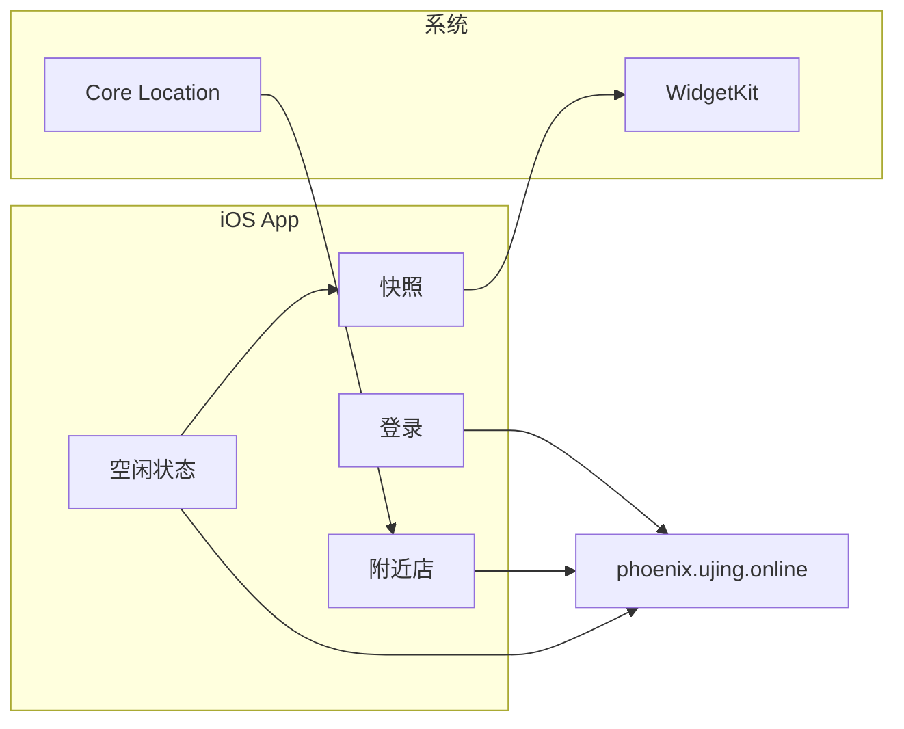

# LiteU

登录 U 净后，按定位选择附近洗衣房，查看洗衣机、烘干机、洗鞋机空闲与等待时间；订单页显示当前账号使用中的机器剩余时间与最近订单，结束前 1 分钟本地通知提醒。主屏幕小组件展示洗衣机最近一次快照。

不含预约、扫码、单台机号。直连 `https://phoenix.ujing.online`，无自建后端。

## 架构


```mermaid
flowchart LR
  subgraph app [iOS App]
    Auth[登录]
    Near[附近店]
    Status[空闲状态]
    Snap[快照]
  end
  subgraph sys [系统]
    Loc[Core Location]
    W[WidgetKit]
  end
  Auth --> API[phoenix.ujing.online]
  Loc --> Near
  Near --> API
  Status --> API
  Status --> Snap
  Snap --> W
```

| 数据 | 存放 |
|---|---|
| JWT、手机号 | Keychain（仅本机，解锁时可读） |
| 选中的 `storeId` | App Group UserDefaults |
| 状态快照（空闲、总数、最短等待、更新时间） | App Group，供小组件读取 |
| 设置（首页显示烘干机/洗鞋机、结束提醒开关） | 标准 UserDefaults |

网络：`URLSession`。

## 用户流程

1. 无 JWT → 手机号 → 发短信 → 验证码 → 存 token。
2. 已登录、未选店 → 定位（可手动改点）→ `stores/near` → 多选保存。
3. 登录后底部三个标签：首页 / 订单 / 设置。
4. 首页按选中 `storeId` 拉各类机器状态（按设置隐藏烘干机、洗鞋机），同时拉使用中订单，下拉刷新。
5. 订单页：使用中订单 + 最近订单（每页 10 条，滚到底加载下一页），下拉刷新。订单标签角标为使用中数量。
6. 每次拉到使用中订单后重排结束提醒；已不在列表里的订单撤销提醒；关闭提醒时全部撤销。
7. 每次成功查询写快照；小组件展示快照及其更新时间。系统刷新约 15 分钟，只重读快照。
8. 查询 401 → 清 token → 回登录。
9. 退出登录（手动或 401）时撤销全部提醒并清除小组件快照；已选洗衣房保留。

## API

基址：`https://phoenix.ujing.online`。业务成功：`code == 0`。

登录与查询使用不同客户端头。发短信签名密钥：`Secrets/captcha-hmac-key.txt`。

### 发短信

`GET /api/v1/wechat/captcha/create`

| | |
|---|---|
| Query | `mobile`，`type=1`，`nonce`（UUID hex），`timestamp`（unix 秒） |
| 签名 | `signature = Base64(HMAC-SHA256(key, nonce \|\| timestamp))`，`key` 为密钥文件的 UTF-8 字节 |
| Header | `x-app-code: BO`，`x-app-version: 1.1.0` |

手机号：`1` + 10 位数字。

### 登录

`POST /api/v1/login`

JSON：`{"mobile","captcha"}`。Header 同发短信。Token：`data.token`。

### 附近洗衣房

`GET /api/v1/stores/near`

Query：`lat`，`lont`，`scope`（默认 2000），`page=1`，`size=50`，`mode=BA`。

Header：`Authorization: Bearer <jwt>`，`x-app-code: ZA`，`x-app-version: 2.4.18`。

列表：`data.storeList[]`。洗衣机计数来自 `storeInfo` 中 `category == 1`：`num` 为总数，`access` 为空闲。

### 机型与等待时间

`GET /api/v1/devices/reserve?storeId=`

Header 同附近店。该店出现在附近结果里时调用。

`data.devices[].device`：`deviceTypeName`，`free`，`total`，`waitTime`（分钟）。按名称归类：含「鞋」为洗鞋机，含「烘干」或「干衣」为烘干机，其余为洗衣机。不缓存。

### 订单

Header 同附近店。契约取自官方 App 前端（`washer/myOrder.js`、`orderDetail.js`）。

| 用途 | 请求 | `data` |
|---|---|---|
| 使用中 | `GET /api/v1/orders/running` | 订单数组 |
| 历史 | `GET /api/v1/orders/history?page=&size=` | 订单数组，不足 `size` 条即末页 |
| 详情 | `GET /api/v1/orders/{orderId}/detail` | 订单对象 |

订单字段：`orderId`，`deviceTypeId`，`deviceTypeName`，`deviceNo`，`storeName`，`status`，`isPauseStatus`，`createAt`（ISO 8601），`remainTime`（秒）。使用中订单逐个再取详情以拿到 `remainTime`。

- 机型名按 `deviceTypeId`：1 波轮机，2 滚筒机，3 烘干机，4 洗鞋机，6 大容量烘干，8 OTT波轮机，9 10kg滚筒机，10 9kg烘干机，11 6.5kg波轮机，12 新10kg滚筒机，13 10kg干衣护理机；其余用 `deviceTypeName`。
- 状态文案按 `status`：10 已预约，20 已支付，21 启动中，22 自洁启动中，24 正在投放洗衣液，29 退单保护，30 自洁中，35 自洁完成，40 运行中，50 订单完成，51 超时未支付，52 启动失败，53 订单已取消，54 超时未启动，60/61 故障中；`isPauseStatus` 为真时显示「机器暂停中」。
- 仅 `status` 为 30/40、未暂停且 `remainTime > 0` 时倒计时：结束时刻 = 拉取时刻 + `remainTime`。

## 领域模型

```text
StoreStatus
  id, name
  idle, total
  machines: [MachineType]
  kinds: [KindStatus]
  waitMinutes

MachineType
  name, kind, idle, total, waitMinutes

KindStatus
  kind (washer / dryer / shoe), idle, total, waitMinutes

Order
  id, machineName, deviceNo, storeName, statusText, createdAt, endsAt
```

`idle` / `total` 为 `category == 1` 汇总。`kinds`：洗衣机空闲/总数用 `idle` / `total`，烘干机、洗鞋机用 `machines` 同类汇总；总数为 0 的类不显示。各类 `waitMinutes` 为同类 `waitTime` 的最小正值。`StoreStatus.waitMinutes` 为洗衣机的等待。

小组件快照：选中店的 `id/name/idle/total/waitMinutes` + `updatedAt`。不存 JWT。

## 通知

本地通知，无推送。只在用户操作时申请权限。

- 空闲提醒：按门店 + 机型手动开关，首次点铃铛时申请权限，在最短等待结束前 2 分钟触发。
- 结束提醒：设置里可关（默认开）。已授权时使用中订单自动安排，在 `endsAt` 前 1 分钟触发；已不足 1 分钟的不安排。未授权时订单页脚注提供「允许通知」（未决定）或「前往系统设置」（已拒绝）。

## 客户端

SwiftUI，iOS 17+（`@Observable`），Swift 6。iPhone 竖屏；iPad 支持全部方向与窗口缩放。未登录：登录 / 选店；登录后：首页 / 订单 / 设置 三个标签。

模块：`Auth`，`UjingClient`，`StoreSelection`，`LaundryStatus`，`Orders`，`WidgetSnapshot`。

权限：定位（附近列表）；Keychain；App Group（主 App + Widget Extension）。

## 小组件

WidgetKit + App Group。展示已选门店空闲数（中尺寸列表，小尺寸一家或汇总）及快照更新时间（非当天带日期）；无快照时提示打开 App。点进 App。可用配置 Intent 选择显示哪几家；未配置时截断已选店列表。小组件只编译 `Sources/Shared`（App Group、模型、快照、配置 Intent）。
